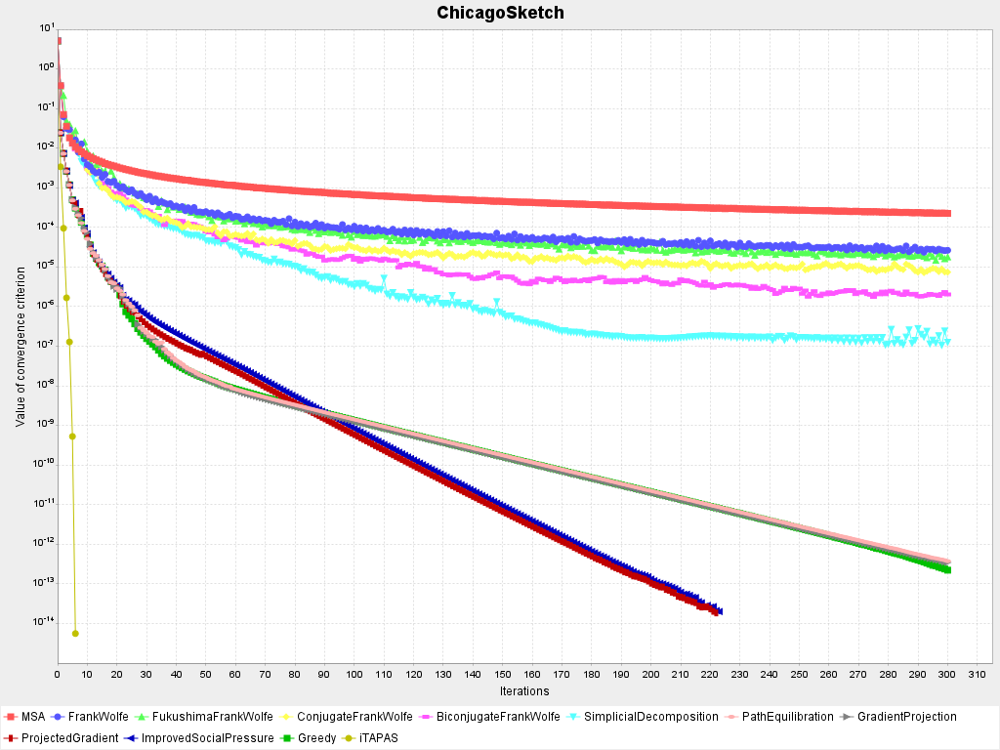

# STA Garden

At first, this project was meant to be a an implementation of various static traffic
assignment algorithms (hence STA garden) with a common object-oriented framework and in
that sense this project is similar to [TAsK](https://github.com/olga-perederieieva/TAsK).
But right now, there are also implemented some parts of dynamic traffic assignment. There
is also some visualisation (see branch `gui`).

This project uses the [TNTP](https://github.com/bstabler/TransportationNetworks) format as
input and output (there are already some networks in `data` folder).
[GMNS datasets](https://github.com/HanZhengIntelliTransport/GMNS_Plus_Dataset/) are also
viable.

## Implemented features

### Static traffic assignment

Hierarchy of STA algorithms is represented using inheretance, where *Algorithm* is the
top-most superclass. Each of the types of STA algorithms (link-based, path-based and
bush/origin-based) have themselves their own abstract class.

#### Algorithms

Link-based algorithms:

- Method of Successive Averages
- Frank-Wolfe
- Fukushima Frank-Wolfe
- Conjugate Frank-Wolfe
- Biconjugate Frank-Wolfe
- Simplicial Decomposition

Path-based algorithms:

- Path Equilibration
- Gradient Projection
- Projected Gradient
- Improved Social Pressure
- Xie's Greedy algorithm

Also, for path-based algorithms, a convergence speed improvement is employed which is
described in the same paper as Xie's Greedy algorithm.

Bush-based algorithms:

- Origin-Based Assignment, incomplete
- Dial's B algorithm, incomplete
- Improved Traffic Assignment by Paired Alternative Segments (iTAPAS)

And All-Or-Nothing assignment for initial flows.

There are also some tries at entropy maximization algorithms, but this is mostly
incomplete.

#### Convergence criterions

All criterions are implemented in class *Convergence* which has *Builder* inner class for
convenient adding of multiple criterions. If multiple convergence criterions are used and
they share some computations (typically shortest path travel time), those common values
are precomputed so that they are not computed twice.

Implemented criterions are:

- Beckmann function (the objective function of static traffic assignment)
- Total system travel time
- Gap
- Three different implementations of relative gap (see the book in bibliography below,
  page 147)
- Average Excess Cost

### Dynamic traffic assignment

Currently, dynamic network loading and a basic route choice using result from STA is
implemented.

#### Link models

- Point queue
- Spatial queue
- Connector (virtual link)
- Cell Transmission Model
- Link Transmission Model

#### Node models

- Linear node
- Daganzo merge
- Daganzo diverge
- Basic signals
- Tampere's unsignalized general intersection
- Virtual origin and destination
- Incremental node models (INM):
    - Basic INM with constant priorities (model equivalent to Tampere's unsignalized,
      different approach)
    - General INM with priorities dependent on flows (just a basic sketch that uses
      Euler's method > inaccurate, it also does not check for violations of sending or
      receiving flow that may appear with flow incrementation)
    - Approximate INM with constraints (INMC)

### Visualization

- Graph with logarithmic scale for plotting RG/AEC
- Graph showing the traffic network with edges colored according to their congestion
- (WIP) JavaFX GUI for dynamic traffic assignment (on branch `gui`)

## Bibliography

For the introduction to traffic assignment problem and for the explanation of many
features implemented in this project I highly recommend the following book:\
[Boyles, S. D., N. E. Lownes, and A. Unnikrishnan. (2025) *Transportation Network
Analysis*, Volume I, Version 1.0.](https://sboyles.github.io/blubook.html)

Otherwise, many classes are annotated with JavaDoc which contain bibliography for the
specific feature/algorithm.